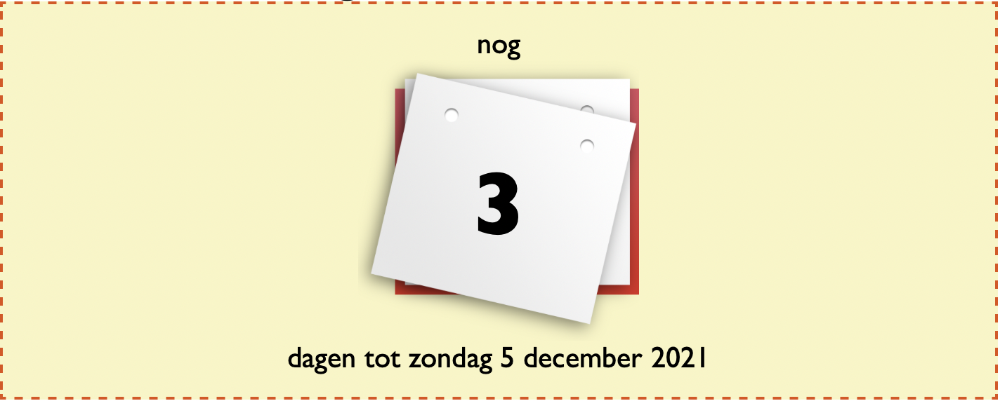

# [SnelAftellen.nl](https://www.snelaftellen.nl)

Hoe lang nog wachten tot Sinterklaas? Wanneer is Nieuwjaar? Over hoeveel nachten gaan we op vakantie? SnelAftellen.nl is je digitale aftelkalender.

## Stack

Frontend:

- [Svelte]
- [SvelteKit]
- [sveltekit-template]

Hosting:

- [TransIP]
- [Netlify]

Backend:

- [Netlify Functions]
- [Netlify Forms]

Marketing (via [Netlify snippet injection]):

- [Google Tag Manager]
- [Google Analytics]

[svelte]: https://svelte.dev
[sveltekit]: https://kit.svelte.dev
[sveltekit-template]: https://github.com/garraflavatra/sveltekit-template
[transip]: https://www.transip.nl
[netlify]: https://www.netlify.com
[netlify functions]: https://www.netlify.com/products/functions/
[netlify forms]: https://www.netlify.com/products/forms/
[netlify snippet injection]: https://docs.netlify.com/site-deploys/post-processing/snippet-injection/
[google tag manager]: https://marketingplatform.google.com/intl/nl/about/tag-manager/
[google analytics]: https://marketingplatform.google.com/intl/nl/about/analytics/

---

## License

[GNU General Public License v3.0](LICENSE) or later.
